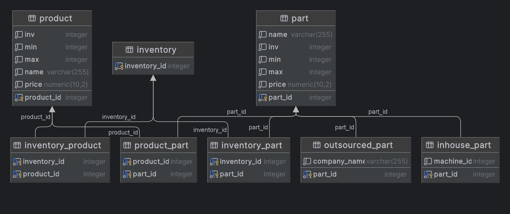
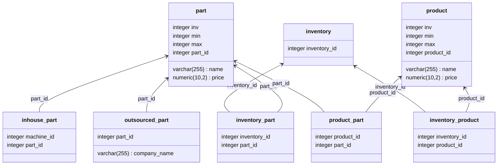

# Inventory Management System

## IntelliJ Diagram

## Mermaid Diagram

```mermaid
classDiagram
direction BT
class inhouse_part {
   integer machine_id
   integer part_id
}
class inventory {
   integer inventory_id
}
class inventory_part {
   integer inventory_id
   integer part_id
}
class inventory_product {
   integer inventory_id
   integer product_id
}
class outsourced_part {
   varchar(255) company_name
   integer part_id
}
class part {
   varchar(255) name
   integer inv
   integer min
   integer max
   numeric(10,2) price
   integer part_id
}
class product {
   integer inv
   integer min
   integer max
   varchar(255) name
   numeric(10,2) price
   integer product_id
}
class product_part {
   integer product_id
   integer part_id
}

inhouse_part  -->  part : part_id
inventory_part  -->  inventory : inventory_id
inventory_part  -->  part : part_id
inventory_product  -->  inventory : inventory_id
inventory_product  -->  product : product_id
outsourced_part  -->  part : part_id
product_part  -->  part : part_id
product_part  -->  product : product_id

```
